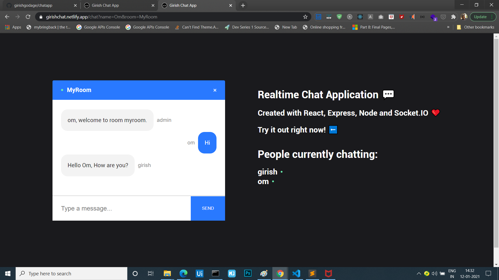

# Realtime Chat Application

### [Live Site](https://girishchat.netlify.com)



## Introduction
we have created a full Realtime Chat Application. We have used  React on the front end, with NodeJS + Socket.io web socket library on the back end. 


Setup:
- run ```npm i && npm start``` for both client and server side to start the development server